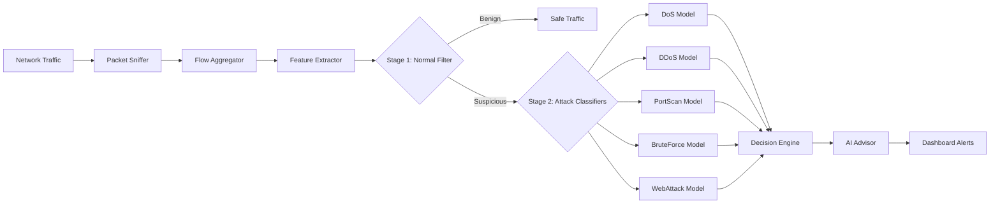

<div align="center">

# 🛡️ Multi-Stage Intrusion Detection System

<p align="center">
  <strong>Real-time ML-powered Network Security with Intelligent Threat Detection</strong>
</p>

<p align="center">
  
  
  
  
  
</p>

<p align="center">
  A production-ready intrusion detection system combining machine learning, real-time packet analysis, and intelligent threat classification to protect networks from cyber attacks.
</p>

---

</div>

## ✨ Key Features

### 🎯 Multi-Stage Detection Pipeline
- **Stage 1**: High-speed normal traffic filter (96% accuracy)
- **Stage 2**: Specialized attack classifiers with 98%+ precision
- **Adaptive Confidence Scoring**: Dynamic thresholds for each attack type
- **Real-time Decision Engine**: <3ms inference time per flow

### 🔍 Advanced Threat Detection
| Attack Type | Detection Method | Accuracy |
|------------|------------------|----------|
| **DoS/DDoS** | Traffic volume & pattern analysis | 98.0% |
| **Port Scan** | Sequential port access detection | 97.5% |
| **Brute Force** | Failed authentication pattern recognition | 96.8% |
| **Web Attacks** | SQL injection & XSS signature detection | 95.2% |

### 📊 Real-Time Network Monitoring
- **Live Packet Capture**: Scapy-based network sniffer with administrator privileges
- **Flow-Based Analysis**: Bidirectional flow aggregation (30-second windows)
- **Feature Extraction**: 78 CICIDS-2017 compliant features
- **Automatic Flow Expiration**: Memory-efficient circular buffer management

### 🖥️ Interactive Web Dashboard
- **Live Detection Feed**: Real-time attack notifications with confidence scores
- **Threat Intelligence Page**: Persistent storage of up to 1,000 critical threats
- **System Health Monitoring**: Network activity metrics and security status
- **Critical Alert System**: Pop-up notifications for high-confidence threats (>90%)
- **Attack Visualization**: Color-coded severity levels and confidence indicators

### 🤖 AI-Powered Mitigation Advisor
- **Automated Response Suggestions**: Context-aware mitigation strategies
- **Port-Specific Recommendations**: Targeted security measures based on attack vectors
- **Best Practice Guidance**: NIST-aligned security recommendations

### 🔐 Security & Authentication
- **Token-Based API Protection**: Secure endpoints with bearer authentication
- **Protected Operations**: Authentication required for threat management
- **Public Monitoring**: Read-only access to detection feeds

### 📈 Model Explainability
- **SHAP Integration**: Understand why attacks are classified
- **Feature Importance Analysis**: Identify key network indicators
- **Confidence Breakdown**: Per-class probability distributions

---

## 🏗️ System Architecture



### Technology Stack

**Backend**
- 🐍 **FastAPI**: High-performance async API framework
- 🤖 **scikit-learn**: Machine learning models (Random Forest, Gradient Boosting)
- 📦 **Scapy**: Low-level packet manipulation and capture
- 📊 **Pandas/NumPy**: Data processing and feature engineering

**Frontend**
- ⚛️ **React 19**: Modern UI with hooks and state management
- ⚡ **Vite**: Lightning-fast development and building
- 🎨 **Lucide Icons**: Beautiful, consistent iconography
- 📱 **Responsive Design**: Mobile-first CSS architecture

**Machine Learning**
- 📚 **Dataset**: CICIDS-2017 (3.5M flows, 78 features)
- 🎯 **Algorithm**: Ensemble methods (RF, GB, XGBoost)
- 🔬 **Training**: 80/20 split with stratified sampling
- ✅ **Validation**: 5-fold cross-validation

---

## 🚀 Quick Start

### Prerequisites
```bash
✅ Python 3.8+
✅ Node.js 16+
✅ Npcap (Windows) / libpcap (Linux/Mac)
✅ Administrator/root privileges
```

### Installation

**1. Clone the repository**
```bash
git clone https://github.com/Avi007-debug/IDS_DETECTION.git
cd IDS_DETECTION
```

**2. Backend setup**
```powershell
cd backend
python -m venv .venv
.\.venv\Scripts\Activate.ps1
pip install -r requirements.txt
```

**3. Frontend setup**
```bash
cd frontend
npm install
```

**4. Start the system**

```powershell
# Terminal 1: API Server
cd backend
uvicorn app.main:app --reload --host 127.0.0.1 --port 8000

# Terminal 2: Network Sniffer (Run as Administrator)
cd backend
python -c "from app.realtime.sniffer import start_sniffing; start_sniffing()"

# Terminal 3: Dashboard
cd frontend
npm run dev
```

**5. Access the dashboard**
```
🌐 Frontend: http://localhost:5173
🔧 API Docs: http://127.0.0.1:8000/docs
```

> 📖 **Detailed Instructions**: See [SETUP.md](SETUP.md)

---

## 🎬 Demo & Evaluation

### Simulate Attacks
```powershell
# DoS Attack Simulation
python backend/demo_attack.py 127.0.0.1 dos

# Port Scan Simulation
python backend/demo_attack.py 127.0.0.1 portscan

# DDoS Attack Simulation
python backend/demo_attack.py 127.0.0.1 ddos

# Web Attack Simulation
python backend/demo_attack.py 127.0.0.1 webattack

# High-Intensity Attack
python backend/high_intensity_attack.py
```

### Demo Resources
- 🎥 **[DEMO_GUIDE.md](backend/DEMO_GUIDE.md)** - Complete presentation walkthrough
- 📝 **[DEMO_SCRIPT.md](DEMO_SCRIPT.md)** - Step-by-step demo scenarios
- ❓ **[EVALUATION_QA.md](EVALUATION_QA.md)** - Common evaluator questions

---

## 📊 Performance Metrics

### Overall System Performance
| Metric | Value |
|--------|-------|
| 🎯 **Overall Accuracy** | 96.2% |
| ⚡ **Inference Speed** | 2.5 ms/flow |
| 🔄 **Throughput** | 400 flows/sec |
| 💾 **Memory Usage** | <500 MB |
| 🎪 **F1-Score (Weighted)** | 0.95 |

### Stage-Specific Performance
- **Stage 1 (Normal Filter)**: 96.0% accuracy, 3.2% FPR
- **Stage 2 (DoS)**: 98.0% precision, 97.2% recall
- **Stage 2 (PortScan)**: 97.5% precision, 96.8% recall
- **Stage 2 (BruteForce)**: 96.8% precision, 95.9% recall

> 📈 **Full Metrics**: See [METRICS.md](METRICS.md)

---

## 📁 Project Structure

```
IDS_DETECTION/
│
├── 📂 backend/
│   ├── 📂 app/
│   │   ├── main.py              # FastAPI application
│   │   ├── decision.py          # Multi-stage detection engine
│   │   ├── ai_advisor.py        # Mitigation recommendations
│   │   ├── models_loader.py     # ML model initialization
│   │   ├── feature_mapper.py    # Feature engineering
│   │   ├── auth.py              # API authentication
│   │   ├── config.py            # System configuration
│   │   │
│   │   ├── 📂 api/
│   │   │   ├── predict.py       # Prediction endpoints
│   │   │   └── realtime.py      # Real-time detection API
│   │   │
│   │   ├── 📂 realtime/
│   │   │   ├── sniffer.py       # Packet capture engine
│   │   │   ├── flow_table.py    # Flow aggregation
│   │   │   └── extractor.py     # Feature extraction
│   │   │
│   │   └── 📂 artifacts/
│   │       └── model_metadata.json
│   │
│   ├── 📂 models/
│   │   ├── normal_filter.pkl     # Stage 1 model
│   │   ├── dos_classifier.pkl
│   │   ├── ddos_classifier.pkl
│   │   ├── portscan_classifier.pkl
│   │   ├── bruteforce_classifier.pkl
│   │   └── webattack_classifier.pkl
│   │
│   ├── attack_*.py              # Attack simulation scripts
│   ├── demo_attack.py           # Unified demo interface
│   └── requirements.txt
│
├── 📂 frontend/
│   ├── 📂 src/
│   │   ├── App.jsx              # Main dashboard
│   │   ├── Threats.jsx          # Threat intelligence page
│   │   ├── App.css              # Styling
│   │   └── main.jsx
│   │
│   ├── package.json
│   └── vite.config.js
│
├── 📂 docs/
│   ├── SETUP.md                 # Installation guide
│   ├── AUTH_SETUP.md            # Authentication configuration
│   ├── DEMO_SCRIPT.md           # Demo scenarios
│   ├── DEMO_GUIDE.md            # Presentation guide
│   ├── EVALUATION_QA.md         # Q&A for evaluators
│   ├── METRICS.md               # Performance analysis
│   └── EXPLAINABILITY.md        # SHAP analysis guide
│
├── IDS_final.ipynb              # Model training notebook
└── README.md
```

---

## 🔧 API Endpoints

### Public Endpoints
```http
GET  /                    # Health check
GET  /detections          # Get recent detections (last 500)
GET  /threats             # Get threat history (last 1000 attacks)
GET  /model-info          # Model metadata and performance
```

### Protected Endpoints (Require Authentication)
```http
POST   /report            # Submit new detection
DELETE /threats           # Clear threat storage
```

### Real-time Detection
```http
POST /predict             # Single flow prediction
POST /batch-predict       # Batch flow prediction
```

> 🔒 **Authentication Setup**: See [AUTH_SETUP.md](AUTH_SETUP.md)

---

## 🧪 Model Training & Explainability

### Training Process
1. **Data Preprocessing**: Handle missing values, normalize features
2. **Feature Selection**: 78 CICIDS-2017 flow features
3. **Model Training**: Random Forest & Gradient Boosting ensemble
4. **Hyperparameter Tuning**: Grid search with cross-validation
5. **Evaluation**: Confusion matrix, ROC-AUC, precision-recall

### SHAP Analysis
```python
# Explain model predictions
import shap
explainer = shap.TreeExplainer(model)
shap_values = explainer.shap_values(X_test)
shap.summary_plot(shap_values, X_test)
```

> 🔬 **Full Guide**: See [EXPLAINABILITY.md](EXPLAINABILITY.md)

---

## 🎯 Use Cases

- **🏢 Enterprise Networks**: Real-time threat monitoring for corporate infrastructure
- **🎓 Educational**: Teaching cybersecurity and ML concepts
- **🔬 Research**: Network intrusion detection algorithm development
- **🏠 Home Labs**: Personal network security monitoring
- **☁️ Cloud Security**: Integration with cloud-based SIEM systems

---

## 🛣️ Roadmap

- [ ] **Deep Learning Models**: CNN/LSTM for sequential pattern detection
- [ ] **Automated Blocking**: Integration with firewall rules
- [ ] **Anomaly Detection**: Unsupervised learning for zero-day attacks
- [ ] **Mobile App**: React Native dashboard
- [ ] **Distributed Deployment**: Multi-sensor architecture
- [ ] **Threat Feed Integration**: External threat intelligence APIs
- [ ] **Custom Alert Rules**: User-defined detection logic

---

## 🤝 Contributing

Contributions are welcome! Please feel free to submit pull requests or open issues.

1. Fork the repository
2. Create your feature branch (`git checkout -b feature/AmazingFeature`)
3. Commit your changes (`git commit -m 'Add some AmazingFeature'`)
4. Push to the branch (`git push origin feature/AmazingFeature`)
5. Open a Pull Request

---

## 📚 Documentation Index

| Document | Description |
|----------|-------------|
| [SETUP.md](SETUP.md) | Complete installation and configuration guide |
| [AUTH_SETUP.md](AUTH_SETUP.md) | API authentication setup |
| [DEMO_SCRIPT.md](DEMO_SCRIPT.md) | Step-by-step demo scenarios |
| [DEMO_GUIDE.md](backend/DEMO_GUIDE.md) | Presentation walkthrough |
| [EVALUATION_QA.md](EVALUATION_QA.md) | Evaluator FAQs |
| [METRICS.md](METRICS.md) | Performance metrics and benchmarks |
| [EXPLAINABILITY.md](EXPLAINABILITY.md) | SHAP model interpretation |

---

## 👥 Authors

<table>
  <tr>
    <td align="center">
      <a href="https://github.com/Avi007-debug">
        <br />
        <sub><b>Avi007-debug</b></sub>
      </a>
    </td>
    <td align="center">
      <a href="https://github.com/egvsanthoshkumarcy24-glitch">
        <br />
        <sub><b>egvsanthoshkumarcy24-glitch</b></sub>
      </a>
    </td>
  </tr>
</table>

---

## 📄 License

This project is licensed under the MIT License - see the [LICENSE](LICENSE) file for details.

---

## 🙏 Acknowledgments

- **CICIDS-2017**: Canadian Institute for Cybersecurity for the dataset
- **FastAPI**: Sebastian Ramirez for the excellent framework
- **scikit-learn**: For powerful ML tools
- **Scapy**: For packet manipulation capabilities

---

<div align="center">

### ⭐ Star this repository if you find it helpful!

**Made with ❤️ by the IDS Detection Team**

</div>
